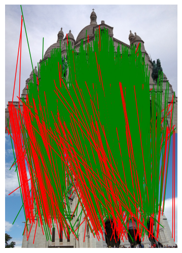
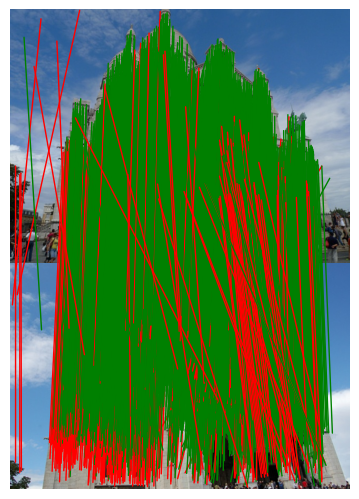

# High-dimensional Convolutional Networks for Geometric Pattern Recognition

### Image Correspondences

#### Download YFCC100M Dataset

```
bash scripts/download_yfcc.sh /path/to/yfcc100m
```

#### Preprocess YFCC100M Dataset

SIFT

```
python -m scripts.gen_2d \
  --source /path/to/yfcc100m \
  --target /path/to/save/processed/dataset \

```

UCN

```
python -m scripts.gen_2d \ 
    --source /path/to/yfcc100m \
    --target /path/to/save/processed/dataset \
    --feature ucn \
    --onthefly \
    --ucn_weight /path/to/pretrained/ucn/weight
```

#### Training Network

Train an image correspondence network.

```
bash scripts/train_2d.sh "-experiment1" \
    "--data_dir_raw /path/to/raw/yfcc \
    --data_dir_processed /path/to/processed/yfcc"
```

#### Testing on YFCC100M Dataset

```
python -m scripts.benchmark_yfcc \
  --data_dir_raw /path/to/yfcc100m \
  --data_dir_processed /path/to/processed/dataset \
  --weights /path/to/checkpoint \
  --out_dir /path/to/save/outputs \
  --do_extract
```

#### Demo on YFCC100M Dataset

Following demo_2d script will download UCN and our best model(PyramidNetSCNoBlock) weights and test it on few pairs of images. The visualization output will be saved on './visualize' directory. 

```
python demo_2d.py
```




#### Model Zoo

| Model | Dataset | Link |
| ----- | ------- | ---- |
| PyramidNetSCNoBlock | YFCC100MDatasetUCN | [download](http://cvlab.postech.ac.kr/research/hcngpr/data/2d_pyramid_ucn.pth) |
| ResNetSC | YFCC100MDatasetExtracted | [download](http://cvlab.postech.ac.kr/research/hcngpr/data/2d_resnetsc.pth)
| ResUNetINBN2G | YFCC100MDatasetExtracted | [download](http://cvlab.postech.ac.kr/research/hcngpr/data/2d_resunet.pth) |
| OANet   | YFCC100MDatasetExtracted | [download](http://cvlab.postech.ac.kr/research/hcngpr/data/2d_oa.pth)   |
| LFGCNet | YFCC100MDatasetExtracted | [download](http://cvlab.postech.ac.kr/research/hcngpr/data/2d_lfgc.pth) |

#### Raw data for Fig#

[Prec-Recall](http://cvlab.postech.ac.kr/research/hcngpr/data/prec_recall_raw.txt)

---
